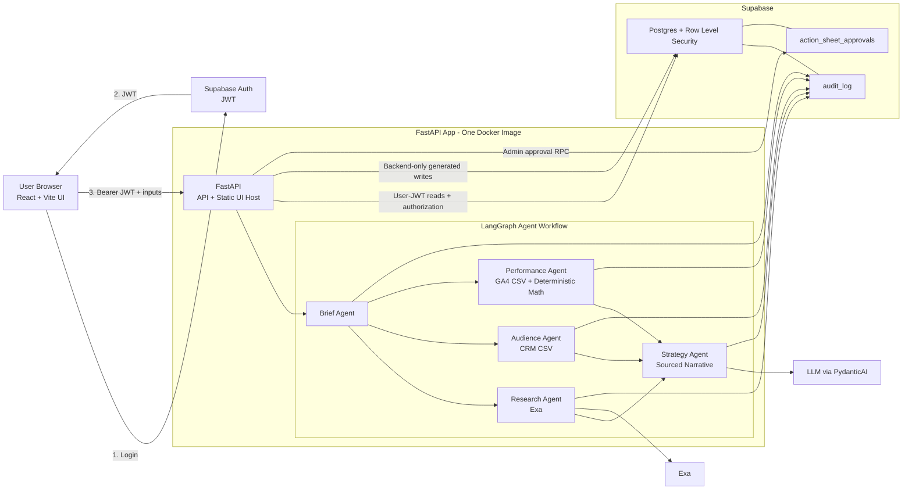

# MIRA Agent

MIRA is an open-source reference implementation for production-shaped marketing intelligence
agents. It combines FastAPI, React/Vite, Supabase Auth + Postgres RLS, LangGraph, PydanticAI,
agent-by-agent audit trails, deterministic media-budget allocation, and Admin approval into one
Dockerized application.

The main workflow turns a free-text campaign brief, CRM CSV, and GA4 CSV into a sourced media-plan
document. The LLM writes the strategy narrative; budget allocation numbers come from deterministic
Python logic in `src/mira_agent/services/mmm.py`.

## What This Shows

- Supabase JWT verification at the API boundary.
- User-JWT-bound RLS reads for reports, audits, organizations, and roles.
- Backend-only trusted writes after route-level authorization.
- Document-level Admin approval for generated strategy outputs.
- Parallel agent workflow: `brief -> research + audience + performance -> strategy`.
- Deterministic response-curve math for budget allocation, separate from LLM prose.
- Synthetic reviewer CSVs in [`samples/`](samples/) for repeatable local demos.

## Architecture



Legacy `/api/analyze` graph: router -> Exa research -> PydanticAI content recommendations.

## Local Setup

```bash
cp .env.example .env
uv sync
supabase start
supabase db reset
uv run python scripts/create_demo_users.py
make dev
```

The seed script writes `.demo.env` with fresh JWTs and `DEMO_PASSWORD`; the file is ignored by
Git and should stay local.

`.env` must include local Supabase values plus:

```bash
LLM_PROVIDER=openai-compatible
LLM_MODEL=gpt-5.5
LLM_BASE_URL=https://api.freemodel.dev/v1
LLM_API_KEY=replace-with-runtime-llm-key
EXA_API_KEY=replace-with-exa-key
EXA_NUM_RESULTS=5
```

Open `http://localhost:8123`, sign in with a seeded Analyst user, submit the media-plan input
with CRM and GA4 CSV files, then view the report and audit tabs. The generated action-sheet ID is
retained when you sign out; sign in as Admin and the report reloads so you can approve or reject
the pending document approval. You can also load any RLS-visible report by action-sheet ID. Use
Export Markdown from the report view.

For a repeatable reviewer run, use `samples/crm-demo.csv`, `samples/ga4-demo.csv`, and the brief in
`samples/README.md`.

The browser loads Supabase runtime config from `/api/config`; no `VITE_*` Supabase values are
required for Docker or Azure.

## Security Model

- Browser-authenticated users cannot directly insert or update generated campaign, run,
  action-sheet, approval, or audit records.
- FastAPI verifies the Supabase JWT before protected API routes run.
- Report and audit reads use the user's JWT with the Supabase anon key so RLS applies.
- Generated writes use the backend-only service-role key only after route-level user authorization.
- `/api/config` returns only browser-safe runtime config.
- Raw uploaded CSV contents are parsed in memory; reports and audit rows store aggregate outputs.
- CRM and GA4 CSV uploads are capped at 2 MB each.

## Validate

```bash
make validate
cd ui && npm run build
```

For local Supabase and real-JWT checks:

```bash
supabase start
supabase db reset
uv run python scripts/create_demo_users.py
make test-rls
make dev
make health
```

The RLS suite refuses to mutate a non-local Supabase project unless
`RUN_REMOTE_RLS_TESTS=1` is also set explicitly.

`make dev` starts `mira_agent.main:app` on port `8123`. Health endpoints:

```bash
curl -fsS http://localhost:8123/health
curl -fsS http://localhost:8123/health/db
curl -fsS http://localhost:8123/api/config
```

## API Routes

- `GET /health`
- `GET /health/db`
- `GET /api/config`
- `POST /api/media-plan`
- `POST /api/analyze`
- `GET /api/action-sheets/{action_sheet_id}`
- `GET /api/runs/{run_id}/audit`
- `POST /api/action-sheets/{action_sheet_id}/approvals/{recommendation_id}`

## Azure Smoke

Deploy with runtime env vars and cloud secret references. Do not commit cloud credentials, API
keys, Supabase service-role keys, demo passwords, or JWTs. See `ops/azure/README.md` for a
parameterized Azure Container Apps smoke-deploy template.

## Security

See [`SECURITY.md`](SECURITY.md).

## License

MIT. See [`LICENSE`](LICENSE).
