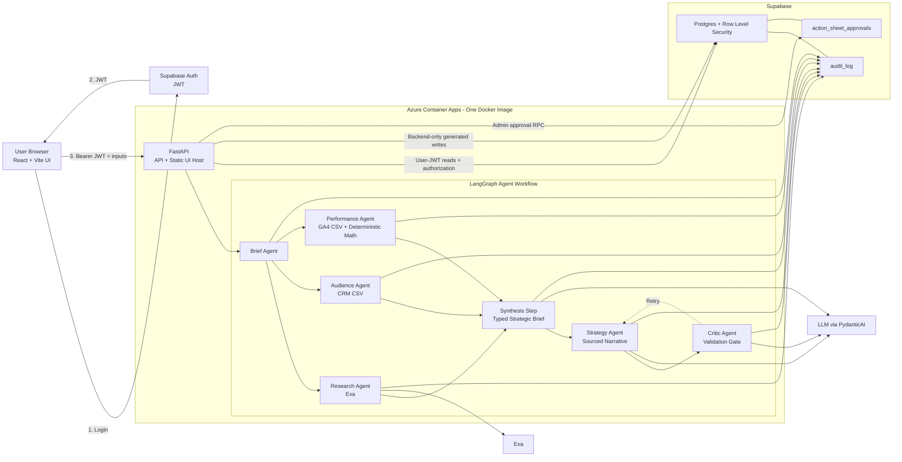

# MIRA Reference Proof

MIRA is a marketing intelligence agent reference implementation that turns a campaign brief, CRM
CSV, and GA4 CSV into a sourced media-plan document with deterministic budget allocation, an
agent-by-agent audit trace, and Admin approval.

## Links

- Repository: https://github.com/georgeschamma/mira-agent
- Synthetic reviewer data: [`samples/`](samples/)
- Demo recording script: [`docs/demo-script.md`](docs/demo-script.md)
- Responsible AI: [`docs/responsible-ai.md`](docs/responsible-ai.md)

Evidence pin: merged commit `5e95e7457f9f81d84e7778515a9be2d174330928`, deployed image
`miraphase2ocxng.azurecr.io/mira-agent:phase-3-5e95e74-amd64`, Azure Container Apps revision
`mira-agent-phase-2--0000014`.

Reviewer credentials are provided privately. No passwords, JWTs, service-role keys, LLM keys, or
Exa keys are committed to this repository.

## Reviewer Path

1. Start the app locally or open a maintainer-provided demo deployment, then sign in as
   `analyst@mira.local` using the privately supplied password.
2. Keep the prefilled demo organization ID and brief, or paste the brief from
   [`samples/README.md`](samples/README.md).
3. Upload [`samples/crm-demo.csv`](samples/crm-demo.csv) and
   [`samples/ga4-demo.csv`](samples/ga4-demo.csv), then run the media plan.
   Generation can take about 1 to 3 minutes because the workflow calls external research and narrative
   providers.
4. Inspect the strategy document, deterministic budget table, recommended tests, sources, and
   Audit Trace tab. The current graph writes seven rows:
   `brief -> research -> audience -> performance -> synthesize -> strategy -> critic`.
5. Sign out, sign in as `admin@mira.local`, and approve or reject the retained document.
6. Export the report as Markdown.

## System Architecture

## Trust Boundaries

- Browser-authenticated users cannot directly insert or update generated campaign, run,
  action-sheet, approval, or audit records.
- FastAPI uses the user JWT for organization authorization and RLS-protected reads.
- After authorization, FastAPI uses a backend-only service-role client for trusted generated
  writes. The service-role key is never returned by `/api/config` or exposed to the browser.
- RLS helper functions live in a non-exposed private schema.
- CRM rows are aggregated in memory; raw CSV contents and emails are not persisted in reports or
  audit rows.
- Budget numbers come from deterministic Python response-curve logic. The LLM writes sourced
  narrative only.

## Verification Evidence

| Evidence | Result |
|---|---|
| Backend compile, Ruff, unit, and API validation | `make validate`: 103 tests passed on June 12, 2026 |
| Production frontend build | `make ui-build`: passed on June 12, 2026 |
| Frontend dependency audit | `npm audit --omit=dev`: 0 vulnerabilities |
| Local Supabase migration reset | passed |
| Local and hosted real-JWT security test | passed; remote opt-in command recorded in [`evidence/authorization-smoke-5e95e74-20260612.summary.json`](evidence/authorization-smoke-5e95e74-20260612.summary.json) |
| Hosted Supabase migration | `202606040001_secure_backend_writes.sql` applied |
| Live health, DB health, and config | `/health`, `/health/db`, and `/api/config` returned 200 on revision `mira-agent-phase-2--0000014` |
| Live $1,000 baseline media-plan smoke | 7-step audit passed for `brief -> research -> audience -> performance -> synthesize -> strategy -> critic`. Evidence: [`evidence/azure-smoke-baseline-5e95e74-20260612-191050.summary.json`](evidence/azure-smoke-baseline-5e95e74-20260612-191050.summary.json), [`evidence/azure-smoke-baseline-5e95e74-20260612-191050.md`](evidence/azure-smoke-baseline-5e95e74-20260612-191050.md) |
| Live $10,000 growth media-plan smoke | 7-step audit passed with deterministic expansion rows for `meta` and `tiktok`. Evidence: [`evidence/azure-smoke-growth-5e95e74-20260612-192459.summary.json`](evidence/azure-smoke-growth-5e95e74-20260612-192459.summary.json), [`evidence/azure-smoke-growth-5e95e74-20260612-192459.md`](evidence/azure-smoke-growth-5e95e74-20260612-192459.md) |
| Outcome benchmark | Production run `aef0a0e0-bcff-4aa0-88bf-7c9f4bb8889f`: brief + CRM + GA4 -> sourced, audited media plan in 3.0 minutes. Evidence: [`evidence/benchmark-growth-5e95e74-20260612.json`](evidence/benchmark-growth-5e95e74-20260612.json) |
| Live authorization smoke | direct-write denial, tenant isolation, Analyst denial, Admin approval, and Phase 3 document approval passed |

Production model configuration is runtime-configurable through `LLM_PROVIDER`, `LLM_BASE_URL`,
`LLM_API_KEY`, and `LLM_MODEL`; the deployed June 12 audit rows record `gpt-5.5` for synthesis and
strategy.

## Honest Limitations

- The budget engine is a heuristic saturation-curve fit, and the allocation policy layer is a deterministic B2B rules layer (not causal Bayesian MMM).
- v1 accepts CRM and GA4 CSV uploads; it does not include HubSpot OAuth or direct GA4 API access.
- MIRA does not make autonomous changes to ad platforms.
- Public signup, payments, scheduled jobs, and multi-organization Admin management are out of scope for this reference implementation.
- Research insights extraction, synthesis, and narrative quality depend on Exa and the configured LLM provider. The critic node retries narrative generation once if internal contradictions are detected, and narrow fallbacks preserve a partial report when a provider response is unavailable or malformed.
- Expansion-test budgets are deterministic policy outputs. The LLM can write hypotheses and
  narrative, but final test rows are reconstructed from fixed phase-1 budgets, staged reserves,
  and source-reference validation.
- Strategy claims are validated against the run's actual source whitelist. If the model keeps
  fabricating prefix-valid references after retries, the strategy node saves a deterministic
  fallback narrative with valid sources instead of accepting unsupported provenance.
