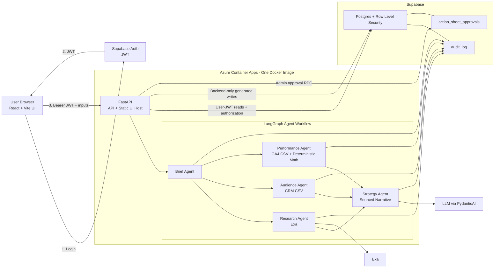

# MIRA Submission Proof

MIRA is a live marketing intelligence agent that turns a campaign brief, CRM CSV, and GA4 CSV into
a sourced media-plan document with deterministic budget allocation, an agent-by-agent audit trace,
and Admin approval.

## Links

- Live app: https://mira-agent-phase-2.orangestone-b32613df.spaincentral.azurecontainerapps.io/
- Repository: https://github.com/georgeschamma/mira-agent
- Reviewer data: [`samples/`](samples/)
- Demo recording script: [`docs/demo-script.md`](docs/demo-script.md)

Reviewer credentials are provided privately. No passwords, JWTs, service-role keys, LLM keys, or
Exa keys are committed to this repository.

## Reviewer Path

1. Open the live app and sign in as `analyst@mira.local` using the privately supplied password.
2. Keep the prefilled demo organization ID and brief, or paste the brief from
   [`samples/README.md`](samples/README.md).
3. Upload [`samples/crm-demo.csv`](samples/crm-demo.csv) and
   [`samples/ga4-demo.csv`](samples/ga4-demo.csv), then run the media plan.
   Generation can take 1 to 3 minutes because the workflow calls external research and narrative
   providers.
4. Inspect the strategy document, deterministic budget table, sources, and Audit Trace tab.
5. Sign out, sign in as `admin@mira.local`, and approve or reject the retained document.
6. Export the report as Markdown.

## System Architecture

## Trust Boundaries

- Browser-authenticated users cannot directly insert or update generated campaign, run,
  action-sheet, approval, or audit records.
- FastAPI uses the user JWT for organization authorization and RLS-protected reads.
- After authorization, FastAPI uses a backend-only service-role client for trusted generated
  writes. The service-role key is never returned by `/api/config` or exposed to the browser.
- RLS helper functions live in a non-exposed private schema.
- CRM rows are aggregated in memory; raw CSV contents and emails are not persisted in reports or
  audit rows.
- Budget numbers come from deterministic Python response-curve logic. The LLM writes sourced
  narrative only.

## Verification Evidence

| Evidence | Result |
|---|---|
| Backend compile, Ruff, unit, and API validation | `make validate`: 65 tests passed |
| Production frontend build | `make ui-build`: passed |
| Frontend dependency audit | `npm audit --omit=dev`: 0 vulnerabilities |
| Local Supabase migration reset | passed |
| Local and hosted real-JWT security test | passed |
| Hosted Supabase migration | `202606040001_secure_backend_writes.sql` applied |
| Azure image | `miraphase2ocxng.azurecr.io/mira-agent:phase-3-e74216c-amd64` |
| Azure ready revision | `mira-agent-phase-2--0000006` |
| Live health and DB health | healthy |
| Live end-to-end media-plan smoke | report, audit trace, and generated writes passed |
| Tracked reviewer CSV live smoke | 12 CRM rows, 16 GA4 rows, saved report, exact audit order passed |
| Live authorization smoke | direct-write denial, tenant isolation, Analyst denial, Admin approval passed |

## Honest Limitations

- The budget engine is a heuristic saturation-curve fit, not Bayesian MMM or causal attribution.
- v1 accepts CRM and GA4 CSV uploads; it does not include HubSpot OAuth or direct GA4 API access.
- MIRA does not make autonomous changes to ad platforms.
- Public signup, payments, scheduled jobs, and multi-organization Admin management are out of
  scope for this submission.
- Research and narrative quality depend on Exa and the configured LLM provider. Narrow fallbacks
  preserve a partial report when a provider response is unavailable or malformed.
